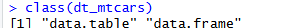
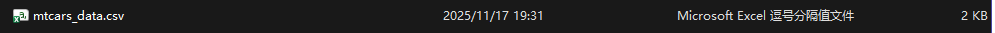
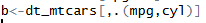
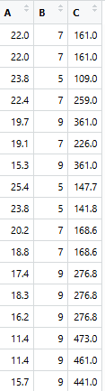
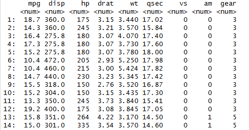
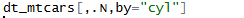
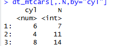
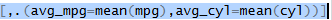
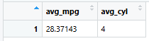

#1.data.table是⼀个什么包，⼀般⽤来做什么？和第三次作业中最后⼀题所讲到的那个数据结构有什么区别和联系？可以⽤什么函数将那个数据结构与data.table格式进⾏转换？

#R语言中一个高性能的数据处理包，主要用于快速处理大型数据集 data.table更快,效率更高,我认为可以算是升级版的data.frame 使用as.data.table()和as.data.frame()可以相互转换

#2.data.table⽤以读取外部数据的函数是哪⼀个？可以⽤来读取什么格式的数据？将data.table格式保存到外部的函数是哪⼀个？

#用于读取外部数据的函数是fread()，用于将data.table保存到外部的函数是fwrite()

#3.data.table的基本语法[i, j, by]当中，i、j、by分别表⽰什么含义？他们都分别可以进⾏ 什么操作？三者同时存在时运⾏的顺序是什么？

#i表示行 进行筛选、排序、连接 j表示列 进行选择、计算、创建 by表示分组 进行分组计算 三者同时存在时运行顺序是 i by j

#4.如果要在data.table中要对某个变量进⾏操作，如何引⽤这个变量？

#直接使用列名

](images/clipboard-1501385976.png)

#5.data.table中如何进⾏⾏筛选？进⾏⾏筛选⼀般需要在i中给定的数据格式是什么（精确到 向量的基本格式）？如何进⾏列筛选？data.frame格式的列筛选的语法如何？data.frame当中的列筛选⽅式能不能⽤data.table当中？

#在i处限定条件就可以进行行筛选 逻辑型 进行列筛选可以使用.()和list()函数 .()函数是data.table特有的 data.frame中不能使用 data.frame当中的列筛选可以用于data.table当中

{width="225" height="17"}

{width="232"}

#使用.()函数可以让这一列变量还是一个data.table 使用[[]]可以让这一列成为向量形式

](images/clipboard-802592693.png)

](images/clipboard-1634571239.png)

#7.data.table中，同时根据多个变量进⾏排序怎么做？如何进⾏升序和降序排列？在基本语法[i, j, by]三个部分当中哪些部分可以直接进⾏排序操作？在i中操作可不可以同时进⾏筛选和排序操作？

#使用order()函数进行排序 默认为升序 如要进行降序排列 只需在列名前加入- 在i中可以直接进行排序 也可以同时进行筛选和排序

](images/clipboard-2399637863.png)

#8.data.table当中，添加或更改⼀列数据，需要⽤到什么函数？如果需要同时添加多 列数据需要怎么做（请在⼀⾏代码中实现）？

#添加或更改用到:=

](images/clipboard-778025664.png)

#9.什么是分组操作？by与keyby有什么区别？data.table中如何进⾏依据多个变量进⾏分组后的组 内求和操作？

#分组操作是指按照一个或多个变量的不同取值将数据分成多个子集，然后对每个子集分别进行计算的分析方法 by分组时不进行排序而keyby在分组时自动进行排序

](images/clipboard-3615166004.png)

#10.在by中如何将分组和筛选进⾏组合操作？

](images/clipboard-3095531668.png)

#11..SD在data.table中表⽰什么？使⽤后会⽣成⼀个什么数据结构？经过分组操作以后⽣成的 结构是怎样的？

#.SD表示一整个data.table 使用后会生成一个data.table数据库 分组后生成的会是全新的data.table 但是没有分组列

](images/clipboard-2398562409.png)

#12..N在data.table当中表⽰什么？使⽤后会⽣成⼀个什么数据结构？经过分组操作以后⽣成的结构是怎样的？

#.N表示总行数 使用后生成的依然是data.table形式 经过分组生成的结构也是data.table

#13.data.table当中的chaining是⼀种什么操作？⼀般⽤在什么时候？如果我想针对mtcars 中的数据先筛选出vs和am都为1的观测，然后再分别计算另外两个变量mpg和cyl的平均值，并⽣成 mpg_aver和cyl_aver两个变量.

#就是链式操作 可以使代码更加简洁

](images/clipboard-161442656.png)

#14.如果两张表存在两个相同的共同变量，要进⾏join的合并操作，需要⽤到什么 语法？有哪两种操作⽅式？两种操作⽅式存在什么区别？

#方法1：先使用setkey设置键 再通过[]进行连接 方法二：使用merge函数进行连接 第一种方式会改变原数据而使用第二种不会改变原数据 第一种需要列名相同而第二种列名不同情况下也可以使用

#15.如果两张表要进⾏bind操作并需要⽤到什么函数（请⼀定使⽤data.table当中 的函数）？

](images/clipboard-3604404224.png)

#16.什么是melt与cast操作？

#melt是宽变长 cast是长变宽

](images/clipboard-2833928972.png)
